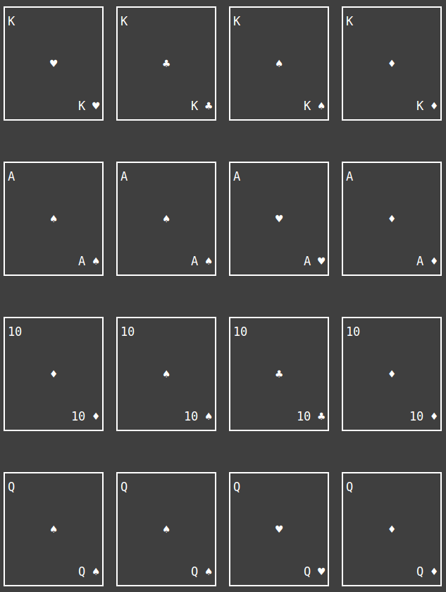
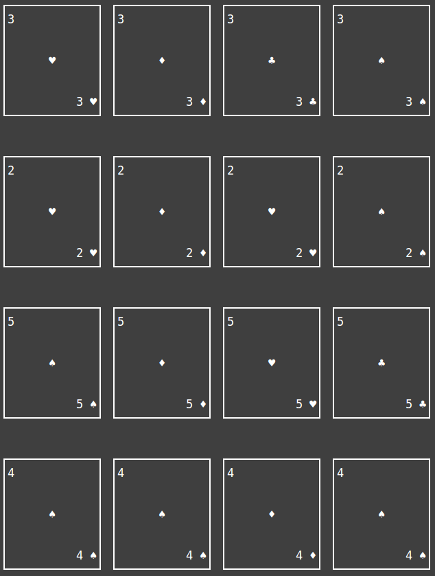

# KPCB_Fellows_Application
Simple Multiplayer Memory game for my KPCB Fellowship application

## Overview

MemZip is a multiplayer card memorization game where users can compete against each other to see who can memorize the most playing cards.

High Scores are recorded externally, so you can play against your friends!

The rules are simple - a group of randomly selected playing cards
will display in the terminal.  The objective is to respond with the correct order
of cards to progress through the game.

The number of cards to memorize will increment as each round completes.
In addition, the display time of the cards will decrease as each round progresses.

## Technical Overview

### Frontend

I ultimately decided that creating my own text art would be the best way to create a user friendly card game that could be interacted with from the terminal.  Using UTF-8 Characters, I was able to create the look of a regular playing card with a specified height and width.  You can see in *card.py*, there is a function called card.create_cards(), which takes a list of dictionaries defining the "Type" and "Suit" of the card and returns a string.

I ran into an issue where the structure of the text art made it difficult to display multiple cards in a single row, however, treating each new line as an item in an array allowed me to *append portions* of each card and return the output as a string.

This function is implemented in a way that allows the developer to display multiple cards in a single row by treating each newline as an array of *fractions* of each playing card.

### Backend

To enable a public scoreboard, I decided to use Amazon's Lambda Serverless Architecture.  In *lambda_function.py*, you can see everything that's going on behind the scenes.

In essense, the client communicates with the Lambda function over HTTP.  An initial request is made which creates a "Session Key", and this key is required for all further communication with the lambda function.  This was implemented to prevent cheating by making a single POST request with a high score to the API Endpoint that updates the score chart.

### Game Logic

*main.py* has a class called main.game() that initiates a new game session.  main.game() contains all of the game logic involved in MemZip.  Here is the game logic in Psuedocode:

- Set the card delay to 5 seconds
- Set the current level to 1
- Start new session
- Display All Cards
- Ask for all answers
- If the incorrect count is equal to 3, the game will end
- Add 1 to the current level
- Add the time decay to the card delay value
- Repeat

### Card Text Art

